# Proyecto de Arquitectura de Software 2020-2 
## Escuela Colombiana de Ingeniería Julio Garavito

## DRAW-CHAT

# DISEÑO INTERFACES

## Login

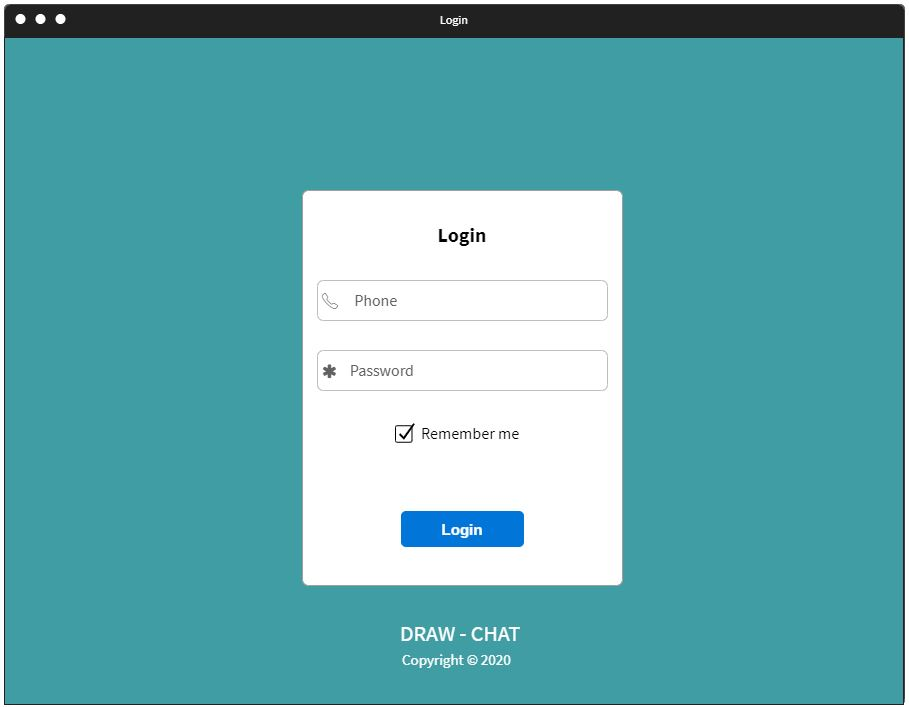

## Chat

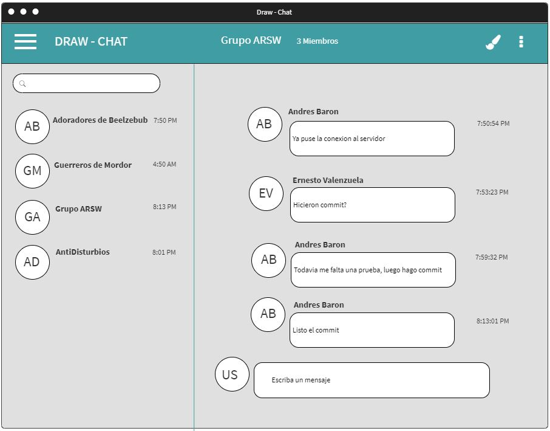

## Tablero

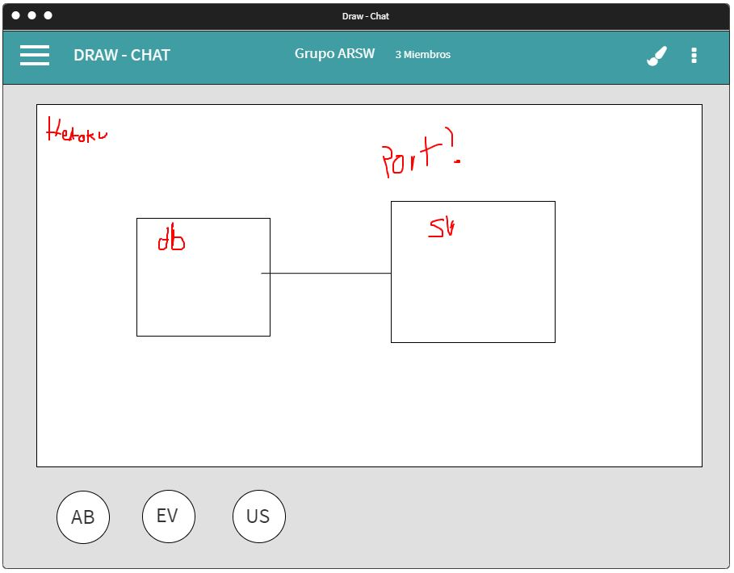

## Menu

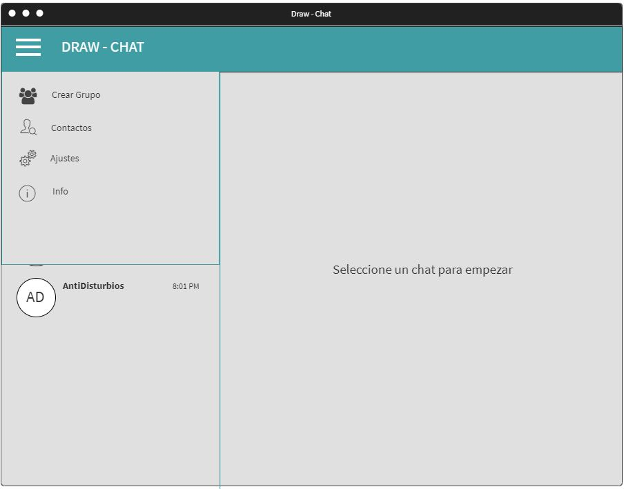

## Contactos

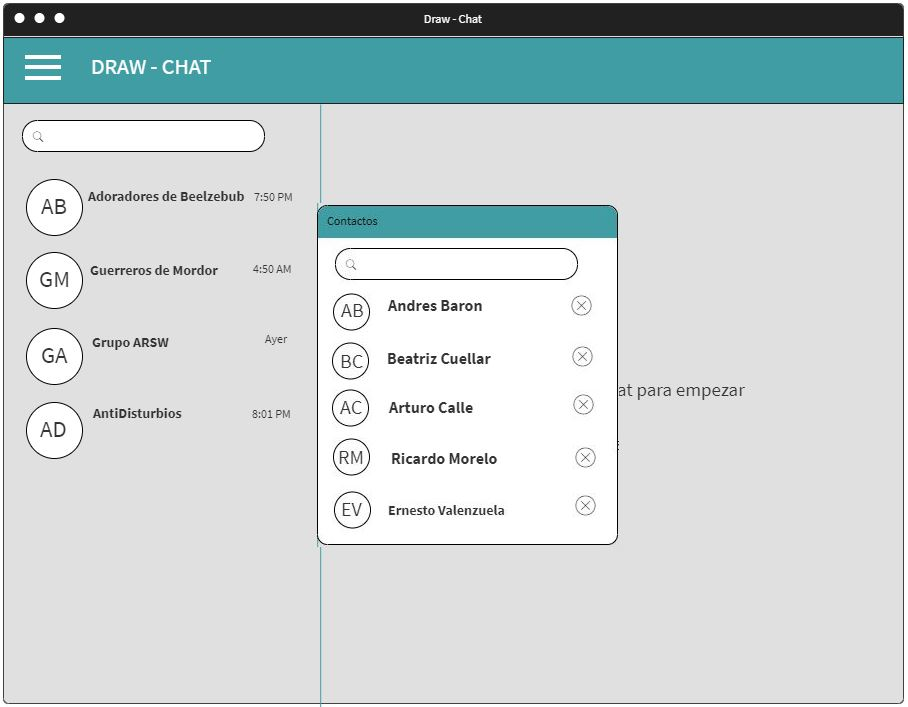

## CrearGrupo

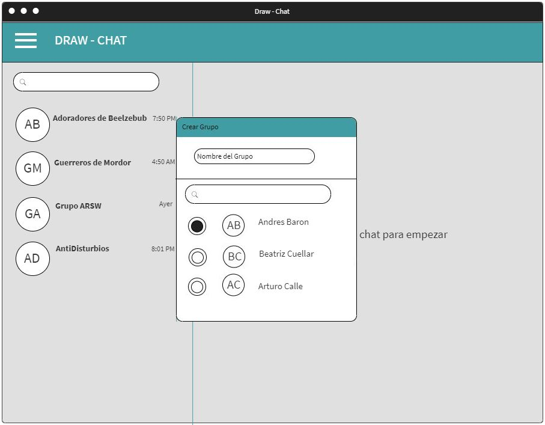

## Opciones de Chat

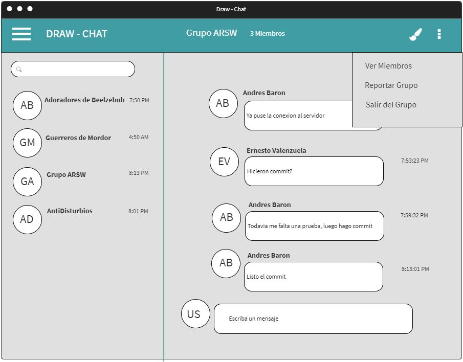

## Principal como usuario nuevo

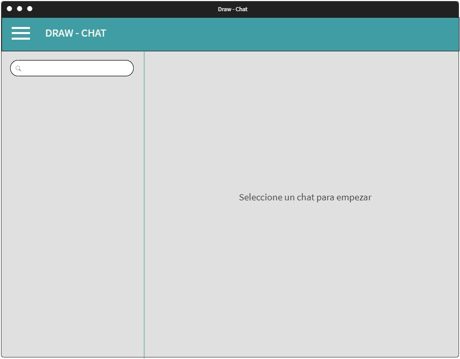

## Principal como usuario registrado

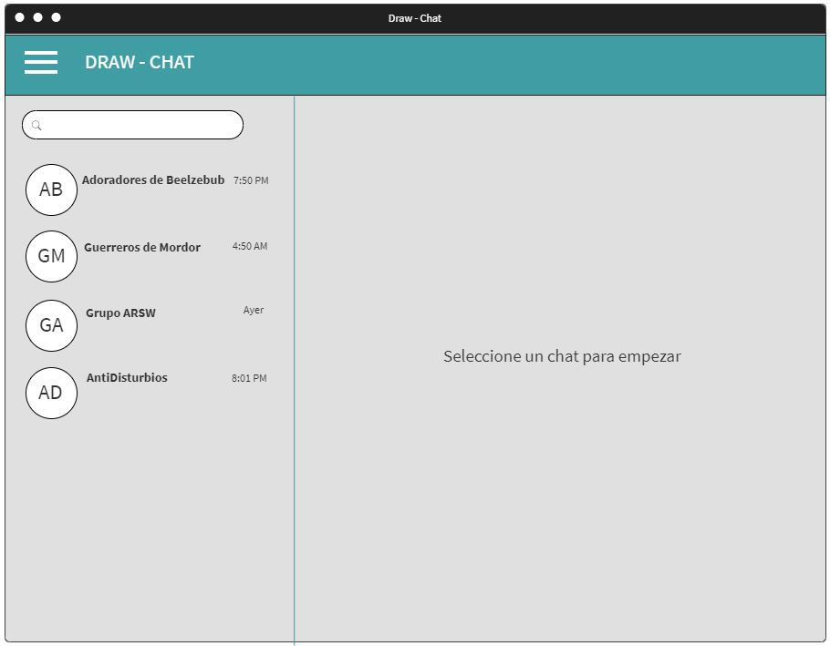

## Ajustes

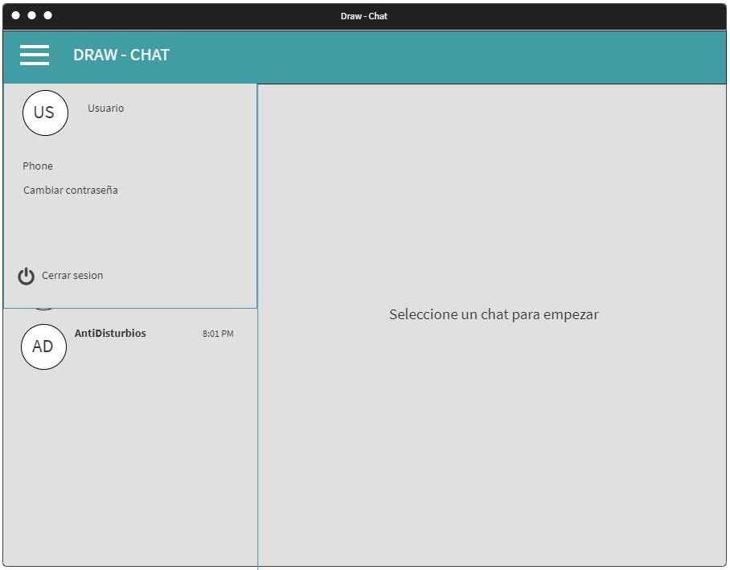

## Info

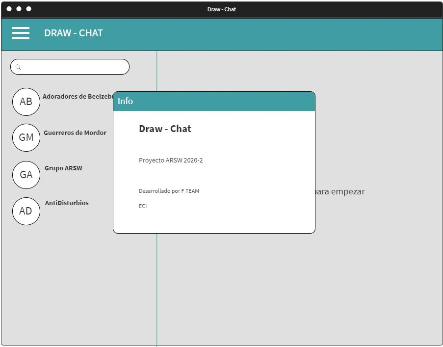