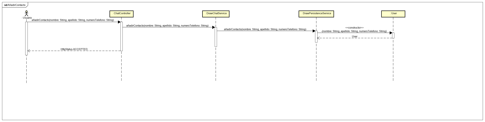
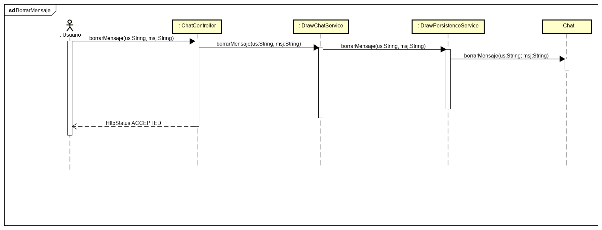
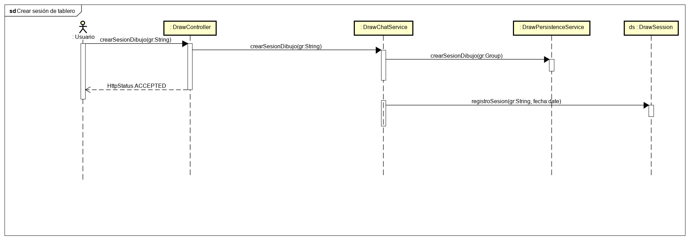
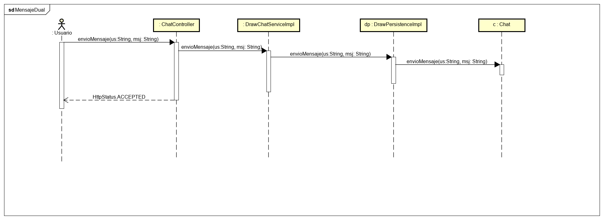
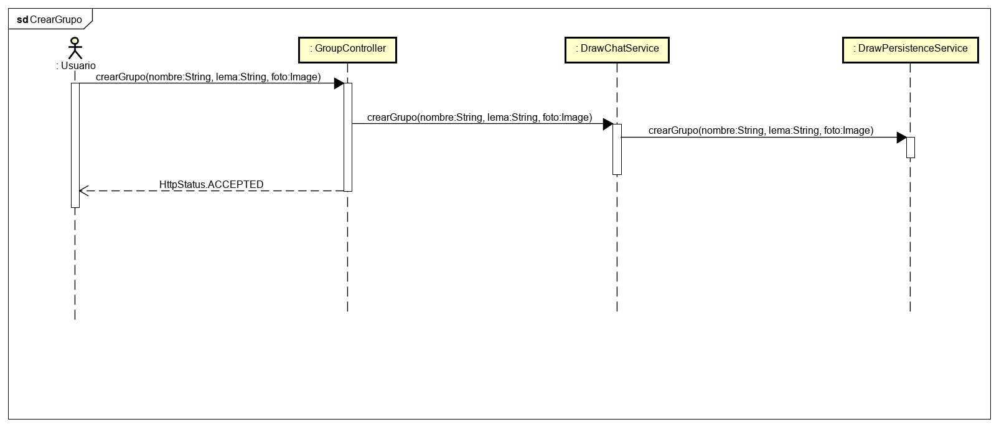
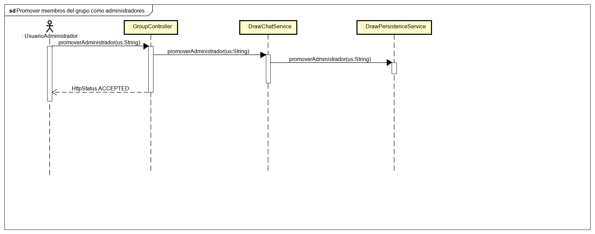

# Proyecto de Arquitectura de Software 2020-2 
## Escuela Colombiana de Ingeniería Julio Garavito

## DRAW-CHAT

# DISEÑO Funcionalidades

## Añadir Contacto

## Borrar Mensaje

## Crear Una Sesion de Dibujo

## Enviar Mensaje

## Crear Grupo

## Promover Administrador

