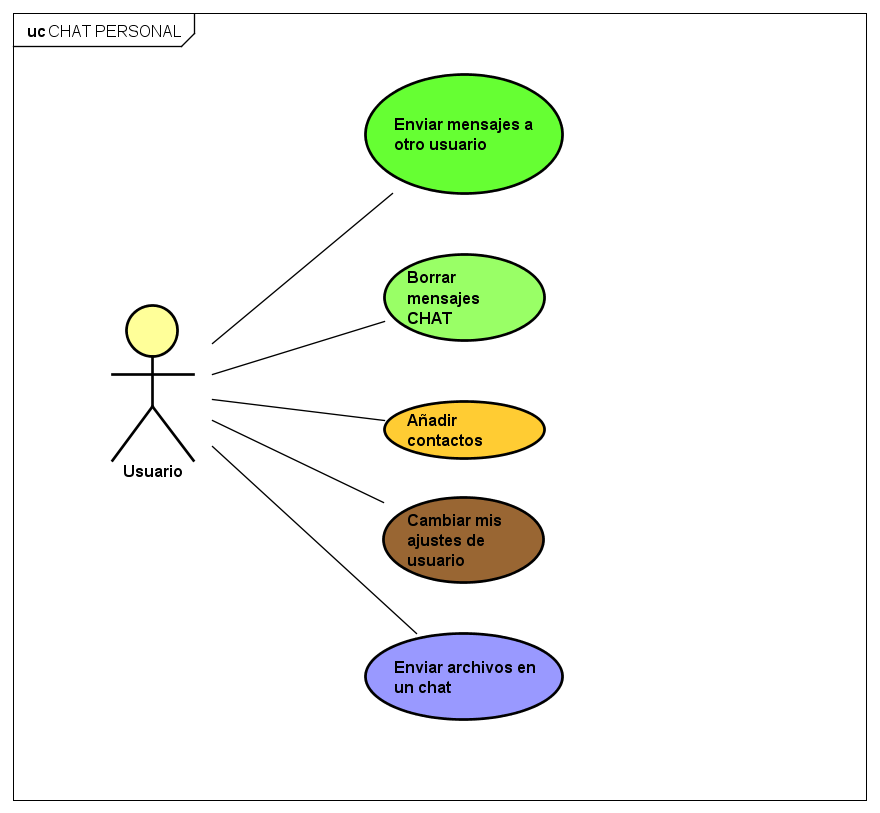
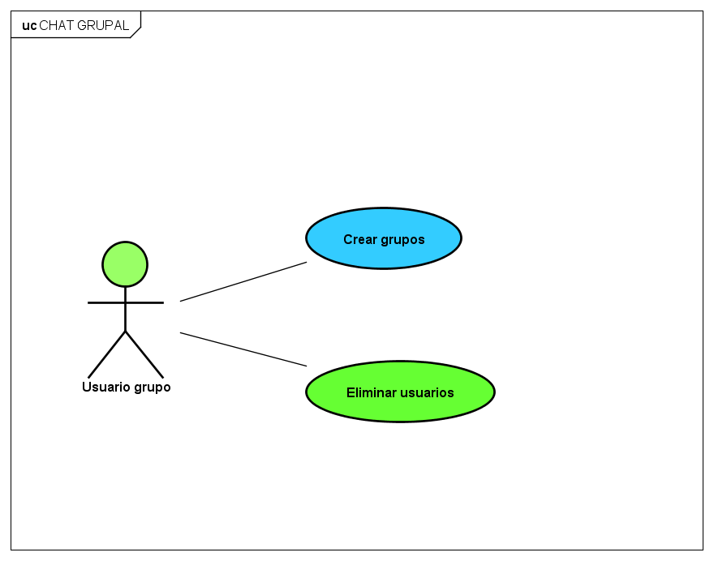
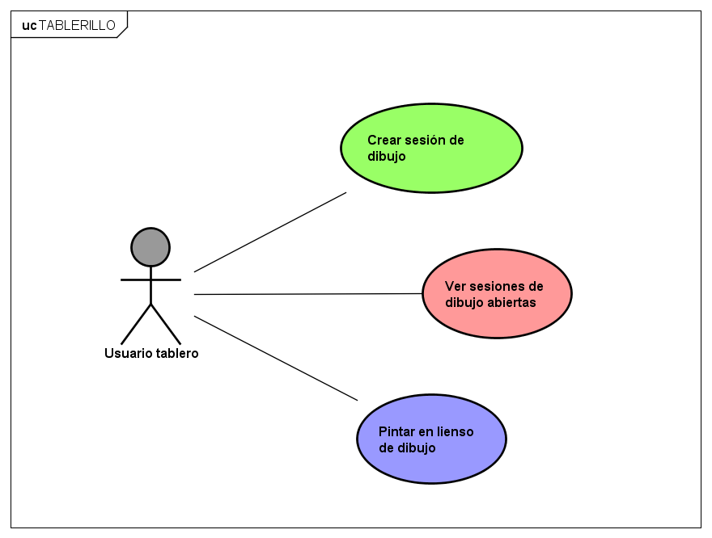
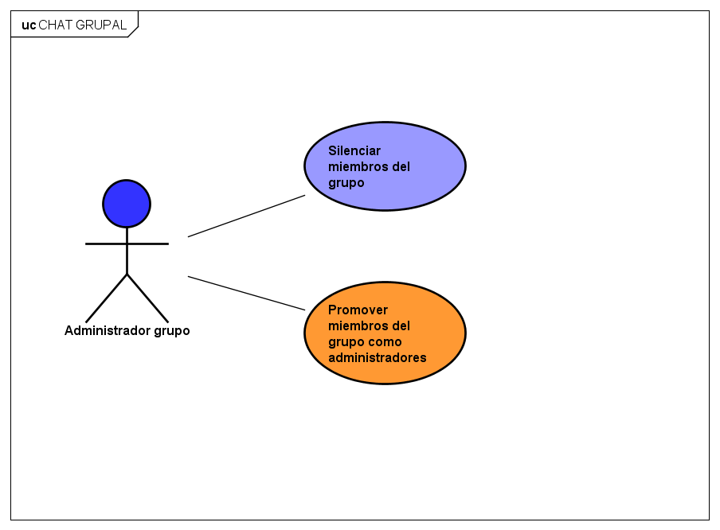

# Proyecto de Arquitectura de Software 2020-2 
## Escuela Colombiana de Ingeniería Julio Garavito

## DRAW-CHAT

# DISEÑO Casos de Uso

## Usuario

**Enviar mensajes a otro usuario**

COMO usuario
QUIERO poder mandar mensajes
PARA PODER comunicarme con otros usuarios conectados a la aplicación.

El objetivo principal de la aplicación es el intercambio de mensajes de texto por medio de una chat en vivio.

**Criterios de aceptación:**
- Se deben aceptar mensajes de cualquier formato de texto.
- El mensaje se debe enviar directamente al otro usuario.
- El mensaje debe quedar guardado con historial de fechas (persistido).

**Borrar mensajes CHAT**

COMO usuario
QUIERO borrar mensajes 
PARA PODER ocultar mensajes

Los mensajes con otro usuario se deben poder borrar para llevar un registro limpio.

**Criterios de aceptación:**
- Para borrar un mensaje, se debe dar la opción de eliminar para todos los miebros o solo para el usuario que lo desea.
- El limite de tiempo para borrar los mensajes es de 10 minutos. Si han pasado 10 minutos, el mensaje se borra unicamente en mi vista.

**Añadir Contactos**

COMO usuario 
QUIERO añadir contactos
PARA PODER crear chats en vivo con otros usuarios

Para ser capaces de crear un chat con otros usuarios, este contacto se hará por medio de número telefónico.

**Criterios de aceptación:**
- El contacto se debe poder añadir con:
    -- Nombre de contacto
    -- Apellido (opcional)
    -- Número telefónico (especificar región)
- Tan pronto se agreguen los contactos se deben mostrar solo los chats de los que tiene la aplicación activa.

**Cambiar mis ajustes de usuario**

COMO usuario
QUIERO cambiar mis ajustes personales 
PARA PODER personalizar mi foto, tag, y otras preferencias

Los ajustes serán personales, por lo que no habrá noción de permisos para ser capaz de cambiarlos.

**Criterios de aceptación:**
- Se debe poder personalizar la foto de usuario
- Se debe poder cambiar el nombre de usuario público
- Se debe poder cambiar de teléfono.
- Una vez se cambie de teléfono, los contactos no deberían poder ver el  teléfono anterior, por lo que debe ser dado como número no activo en la aplicación.

**Enviar archivos en un chat**

COMO usuario
QUIERO enviar archivos
PARA PODER comunicar información en otros formatos

El envío de archivos comprende imágenes y documentos.

**Criterios de aceptación:**
- Los archivos deben poder mandarse en grupos o en chats
- Tienen el mismo, concepto de mensaje, por lo que pueden eliminarse del historial.
- Los archivos deben ser guardados dentro de la base de datos para llevar el historial.

## Usuario Grupo

**Crear grupos**

COMO usuario
QUIERO crear grupos
PARA PODER tener chats en vivo con un conjunto de contactos.

La creación de grupos está limitada a añadir contactos unicamente.

**Criterios de aceptación:**
- El limite de usuarios admitidos para el grupo es de 100 (creador incluido).
- Se debe poder elegir un nombre para el grupo, un lema, y una foto.
- Una vez que el grupo es creado, el creador pasa a tener privilegios de propietario sobre este grupo.

**Eliminar usuarios**

COMO usuario
QUIERO eliminar usuarios del grupo
PARA PODER sacar a los usuarios no deseados

Con objetivo de estudio, se delegará la eliminación  usuarios a cualquiera.

**Criterios de aceptación:**
- Los únicos usuarios que pueden eliminar administradores son otros otros admnistradores.

## Usuario Tablero

**Crear sesion de dibujo**

COMO usuario
QUIERO crear sesión de dibujo
PARA PODER compartir un lienso con el grupo

Las sesiones de dibujo son páginas alternas a los chats que dispuestas para realizar dibujos sencillos de tipo Paint.

**Criterios de aceptación:**
- Se debe presentar la opción (por medio de algún botón) de crear una sesión de dibujo para el grupo (Una sesión por grupo)
- El tablero debería presentar un lienso blanco
- Se debería ser capaz de pintar por medio del mouse 
- Para propositos de alcance, solo se manejará un color estándar.

**Ver sesiones de dibujo abiertas**

COMO usuario
QUIERO ver las sesiones de dibujo abiertas de un grupo
PARA PODER unirme a estas sesiones

Un usuario debería ser capaz de ver si existe una sesión de dibujo del grupo.

**Criterios de aceptación:**
- Debe ser visible si existe una sesión de dibujo abierta, con el objetivo de que el usuario pueda unirse.
- Si el usuario se va a unir, será dirigido a una nueva pestaña con el lienso.

**Pintar en lienso de dibujo**

COMO usuario
QUIERO dibujar en el lienso del grupo
PARA PODER dibujar con los demás miembros del grupo

**Criterios de aceptación:**
- La sesión de dibujo se mantiene abierta para todos los miembros del chat
- Solo puede haber una sesión abierta (pestaña) por integrante
- Una vez todos los miembros de la sesión abandonen, la sesión se cerrará, y su contenido será borrado de memoria.

## Administrador Grupo

**Silenciar miembros de grupo**

COMO administrador del grupo
QUIERO silenciar miembros del grupo
PARA PODER unir más personas al grupo

Un miembro silenciado no es capaz de relizar comentarios, solo puede leerlos.

**Criterios de aceptación:**
- Solo los administradores del grupo deberían ser capaces de silenciar miembros
- La caja de mensaje del miembro silenciado debería aparecer como bloqueada, con un mensaje que notifique acerca del bloqueo.

**Promover miembros del grupo como administradores**

COMO administrador del grupo
QUIERO promover miembros como administradores
PARA PODER dar privilegios a otros usuarios

Al promover a un miembro como administrador, este miembro debería ser capaz de realizar todas las actividades de los casos de uso del administrador de grupo.

**Criterios de aceptación:**
- El administrador debe poder elegir de la lista de miembros del grupo

